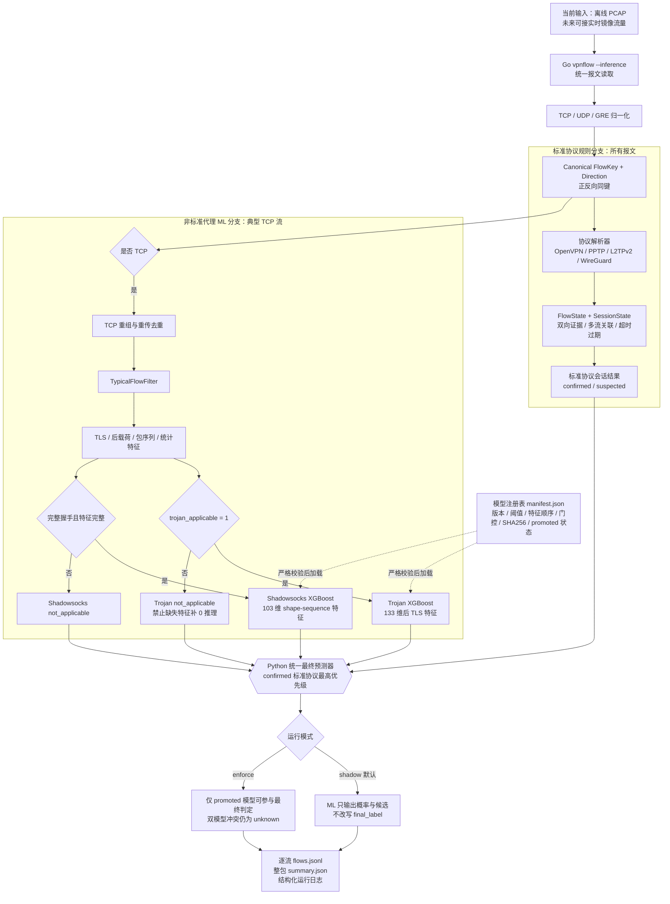
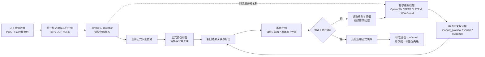

# DPI 侧 TUN+Global 代理流量识别 MVP 计划

## 1. 目标与场景

本计划面向以下场景：

- 部署视角：DPI 侧 / 物理出口侧 / 旁路流量分析。
- 用户侧模式：TUN + global，全局流量经代理客户端转发。
- 初期目标：在一套流水线中识别标准 VPN 协议与非标准代理流量。标准协议首期覆盖 OpenVPN、PPTP、L2TPv2、WireGuard；机器学习分支重点识别 Trojan，并区分 VMess/VLESS、Shadowsocks、普通 HTTPS。
- 工程路线：
  - **Go 负责统一数据面与规则识别**：pcap 读取，TCP/UDP/GRE 归一化，双向流与多流会话状态维护，标准协议规则判定，以及 TCP 重组、典型流筛选和 TLS/inner TLS/聚合特征提取。
  - **Python 负责非标准代理机器学习**：读取 Go 输出的 TCP 特征表，完成训练、评估和推理封装。

一句话总结：

> 先用 Go 对所有 TCP/UDP/GRE 报文执行标准协议规则与会话关联；未命中标准协议的典型 TCP 流，再进入 Python 模型识别 Trojan、VMess/VLESS 和 Shadowsocks。Trojan 模型只接收具备有效 TLS 后载荷特征的流，以优先保证精确率。

---

## 2. MVP 范围

### 2.1 两条识别分支的范围

标准协议规则分支处理：

```text
全部 TCP / UDP / GRE 报文
  → OpenVPN / PPTP / L2TPv2 / WireGuard 包级证据
  → 双向流和跨流会话关联
  → confirmed / suspected / unknown
```

规则分支必须位于 `TypicalFlowFilter` 之前，不能因为流小、握手短或不是 TCP 而丢失协议证据。

机器学习分支只处理：

```text
TCP + 双向 + payload 较大 + 持续时间足够 + 数据传输明显的典型流
```

其中 Trojan 模型增加硬门控：

```text
post_tls_payload_ready == true
```

也就是只有完成 TLS 定位且确实提取到后载荷特征的流才送入 Trojan 模型。缺失后载荷的流不能把相关特征全补 0 后强行推理，应返回 `not_applicable`，再由标准协议分支、其他模型或 unknown 处理。

暂时不处理：

- Hysteria / Tuic 等尚未实现规则的 UDP 代理协议。
- 加密后的 L2TP/IPsec 内层 L2TP 解码。
- ML 分支中的小流、纯 ACK 流、不完整短流、单包、探测与心跳。
- 在线 incremental 半流判断。

### 2.2 MVP 训练标签

训练阶段建议用 4 类：

```text
class 0: clean
class 1: trojan
class 2: vmess_vless
class 3: shadowsocks
```

暂时不训练：

```text
openvpn
pptp
l2tpv2
wireguard
hysteria
tuic
udp_proxy
```

OpenVPN、PPTP、L2TPv2、WireGuard 使用高精度规则引擎和会话状态机识别，不作为 ML 正类；训练时仍可将这些样本作为 hard negative 检验模型误报。Hysteria、Tuic 和其他 UDP 代理协议留待后续扩展。

### 2.3 样本命名保留细粒度

虽然训练时合并为 4 类，但抓包文件名建议保留细粒度：

```text
pos_trojan_tcp_tun_s4_001.pcap
pos_vmess_wstls_tun_s4_001.pcap
pos_vless_reality_tun_s4_001.pcap
pos_vless_grpctls_tun_s4_001.pcap
pos_shadowsocks_tcp_tun_s4_001.pcap
neg_https_direct_s4_001.pcap
```

训练时通过配置合并：

```yaml
label_mapping:
  trojan: trojan
  vmess: vmess_vless
  vless: vmess_vless
  shadowsocks: shadowsocks
  ss: shadowsocks
  https: clean
  clean: clean
```

这样以后如果样本足够，可以把 `vmess_vless` 拆成更细类，不用重新抓包。

---

## 3. 总体架构



图中两条识别分支共享同一套报文归一化和 `FlowKey`。标准协议分支位于典型流过滤之前，因此 UDP、GRE、短流以及跨流会话不会被 ML 的 TCP 筛选条件遗漏。统一预测器以 `confirmed_standard > promoted_ml > unknown` 为最终优先级；`suspected` 标准协议只保留为证据，VMess/VLESS 在当前模型泛化不足时也归入 `unknown`。

### 3.1 Go 负责的内容

- pcap 读取与 TCP/UDP/GRE 归一化。
- 双端点规范化，确保正反向报文得到同一个 `FlowKey`。
- TCP/UDP/GRE 流追踪以及跨流 `SessionState` 维护。
- OpenVPN、PPTP、L2TPv2、WireGuard 包级解码、证据累积和高精度判定。
- TCP SEQ 重组与重传去重。
- 典型流筛选。
- TLS Record 解析。
- ClientHello / JA3 解析。
- outer AppData 长度序列提取。
- inner TLS 握手检测。
- 60s 典型流汇聚字段（仅用于后验解释，不进入 ML）。
- 输出特征表。
- 输出标准协议会话结果和可追溯证据。

### 3.2 Python 负责的内容

- 读取 Go 输出的特征表。
- 标签清洗与 label group 映射。
- 分别训练 Trojan、Shadowsocks XGBoost 二分类模型，并执行按采集来源隔离验证。
- 根据高精度目标选择阈值，导出 XGBoost 原生模型和版本化 `manifest.json`。
- 推理时校验模型哈希、特征顺序、适用性门控和 `promoted` 状态；单模型不可用时安全降级。
- 内部调用 Go 预处理器，对适用流按模型批量评分。
- 执行标准规则与 ML 的统一优先级、冲突处理以及 `shadow/enforce` 模式控制。
- 输出逐流 JSONL、PCAP 汇总 JSON 和结构化运行日志。
- 聚合字段仅用于后验解释与置信度辅助，不进入首版 ML 模型。

---

## 4. Go 预处理器设计

建议新增一个 Go 可执行程序：

```text
vpnflow.exe
```

职责：

```text
pcap → packet normalize → protocol rules/session tracking
                      └→ TCP reassembly → typical-flow filter → feature extraction
   → protocol session JSONL + ML feature CSV/JSONL
```

### 4.1 Go 目录结构

可以基于大模型流量识别项目的 Go 代码改造：

```text
vpnflow/
├── cmd/vpnflow/main.go
├── pkg/input/pcap/
│   └── reader.go
├── pkg/model/
│   ├── packet.go
│   ├── flow.go
│   ├── feature.go
│   └── protocol_result.go
├── pkg/core/protosig/
│   ├── engine.go
│   ├── session.go
│   ├── openvpn.go
│   ├── pptp.go
│   ├── l2tp.go
│   └── wireguard.go
├── pkg/core/flowtracker/
│   ├── tracker.go
│   └── filter.go
├── pkg/core/reassembly/
│   └── reassembly.go
├── pkg/core/tlsparse/
│   ├── record.go
│   ├── clienthello.go
│   ├── ja3.go
│   └── appdata.go
├── pkg/core/innertls/
│   └── detector.go
├── pkg/core/aggregate/
│   └── srcip_aggregator.go
├── pkg/core/features/
│   ├── scalar.go
│   ├── sequence.go
│   ├── tls.go
│   └── aggregate.go
└── pkg/output/
    ├── csv.go
    └── jsonl.go
```

---

## 5. Go 预处理器 CLI

### 5.1 训练特征提取

```powershell
vpnflow.exe extract `
  --pcap-dir samples `
  --manifest samples/metadata/sample_manifest.csv `
  --output features/train_features.csv `
  --mode train `
  --typical-only `
  --min-packets 30 `
  --min-duration 5 `
  --min-payload-bytes 2000 `
  --agg-window 60
```

### 5.2 推理特征提取

```powershell
vpnflow.exe extract `
  --pcap new_capture.pcap `
  --output features/infer_features.jsonl `
  --protocol-output results/protocol_sessions.jsonl `
  --mode infer `
  --typical-only `
  --min-packets 30 `
  --min-duration 5 `
  --min-payload-bytes 2000 `
  --agg-window 60
```

### 5.3 Python 推理封装

```powershell
python scripts/predict.py `
  --features features/infer_features.jsonl `
  --model models/xgb_final.json `
  --output predictions.json
```

或：

```powershell
python scripts/predict.py `
  --pcap new_capture.pcap `
  --model models/xgb_final.json
```

此时 `predict.py` 内部调用：

```text
vpnflow.exe extract --pcap new_capture.pcap --output temp.jsonl --mode infer
```

---

## 6. Go 内部处理流程

### 6.1 总流程

```text
PcapReader
  ↓
Packet normalize + Canonical FlowKey
  ├─→ ProtocolEngine.Observe
  │     ├─ FlowState / SessionState / secondary indexes
  │     └─ protocol_sessions.jsonl
  │
  └─→ TCP FlowTracker
        ↓
      TCPReassembler
        ↓
      Flow close / idle timeout
        ↓
      TypicalFlowFilter
        ↓
      Single-flow FeatureExtractor
        ↓
      Trojan post-TLS availability gate
        ↓
      CSV / JSONL writer
        ↓
      Aggregator.QueryAt(flow.start_ts)  # explain-only
        ↓
      Aggregator.Observe(flow)
```

伪代码：

```go
for packet := range reader.Packets() {
    pkt := NormalizePacket(packet)

    // 必须先执行；UDP、GRE、小流和短握手不能被 TypicalFlowFilter 丢弃。
    protocolResults := protocolEngine.Observe(pkt)
    protocolWriter.WriteAll(protocolResults)

    if !pkt.IsTCP {
        continue
    }

    flow := tracker.GetOrCreate(pkt)
    flow.AddPacket(pkt)

    reassembler.AddSegment(
        flow.Key,
        pkt.Direction,
        pkt.Seq,
        pkt.Payload,
        pkt.Timestamp,
    )

    closedFlows := tracker.FlushClosedOrStale(pkt.Timestamp)

    for _, f := range closedFlows {
        reassembled := reassembler.GetFlowBytes(f.Key)
        f.AttachReassembledBytes(reassembled)

        if !typicalFilter.Keep(f) {
            continue
        }

        // 单流核心特征进入 ML 模型
        features := extractor.ExtractSingleFlowFeatures(f)
        features.TrojanApplicable = features.PostTLSPayloadReady

        // 聚合字段仅用于后验解释/置信度辅助，不进入首版 ML
        agg := aggregator.QueryAt(f.SrcIP, f.StartTS)

        writer.Write(features, agg)

        aggregator.Observe(f)
    }
}

for _, f := range tracker.FlushAll() {
    // 同上
}

protocolWriter.WriteAll(protocolEngine.FlushAll())
```

---

## 7. TCP 重组设计

### 7.1 为什么必须重组

单流特征必须依赖 TCP 重组，否则下列特征会不可靠：

- 外层 TLS Record 解析。
- JA3 / ClientHello 解析。
- AppData 长度序列。
- inner TLS 握手检测。
- 重传去重后的 payload 统计。
- `retransmission_ratio`。

### 7.2 每方向独立重组

每条 TCP 流分两个方向：

```text
uplink:   client → server
downlink: server → client
```

每个方向维护：

```go
type DirectionStream struct {
    HasNextSeq bool
    NextSeq    uint32

    Pending map[uint32]Segment
    Chunks  []Chunk

    RetransmissionCount int
    OutOfOrderCount     int
}
```

Segment：

```go
type Segment struct {
    Seq     uint32
    TS      time.Time
    Payload []byte
}
```

Chunk：

```go
type Chunk struct {
    TS      time.Time
    Payload []byte
}
```

### 7.3 重组逻辑

```go
func (s *DirectionStream) Add(seq uint32, payload []byte, ts time.Time) {
    if len(payload) == 0 {
        return
    }

    if !s.HasNextSeq {
        s.HasNextSeq = true
        s.NextSeq = seq + uint32(len(payload))
        s.Chunks = append(s.Chunks, Chunk{TS: ts, Payload: payload})
        return
    }

    if seq == s.NextSeq {
        s.Chunks = append(s.Chunks, Chunk{TS: ts, Payload: payload})
        s.NextSeq += uint32(len(payload))
        s.flushPending()
        return
    }

    if seq < s.NextSeq {
        s.RetransmissionCount++
        return
    }

    if seq > s.NextSeq {
        s.OutOfOrderCount++
        s.Pending[seq] = Segment{Seq: seq, TS: ts, Payload: payload}
        return
    }
}
```

输出：

```go
type ReassembledFlow struct {
    UplinkBytes   []byte
    DownlinkBytes []byte

    UplinkChunks   []Chunk
    DownlinkChunks []Chunk

    RetransmissionRatio float64
    OutOfOrderRatio     float64
}
```

---

## 8. 典型流过滤

MVP 只保留典型大流。

### 8.1 默认阈值

```yaml
typical_flow_filter:
  protocol: tcp
  min_packets: 30
  min_duration_seconds: 5
  min_payload_bytes: 2000
  min_payload_packets: 5
  require_bidirectional: true
  require_data_both_directions: false
```

说明：

- 要求双向有包。
- 不要求上下行 payload 都大。
- 下载类 HTTPS / 代理流可能上行 payload 很少、下行 payload 很大，因此只要求总 payload 足够。

### 8.2 保留规则

保留：

```text
TCP
AND total_packets >= 30
AND duration >= 5s
AND total_tcp_payload_bytes >= 2000
AND tcp_payload_packet_count >= 5
AND uplink_packets > 0
AND downlink_packets > 0
```

丢弃：

```text
payload=0 的流
纯 ACK 流
短流
小 payload 流
单边残缺流
没有足够数据的流
```

---

## 9. 聚合特征：仅用于后验解释与置信度辅助

### 9.1 聚合对象

Go 预处理器仍然可以基于通过 `TypicalFlowFilter` 的典型流维护 60s Aggregator，但 **MVP 阶段聚合特征不进入 ML 模型训练**，只作为推理结果的解释字段或轻量置信度辅助。

```go
if typicalFilter.Keep(flow) {
    // 1. 查询历史典型流汇聚情况，仅作为 explain / confidence_adjustment
    aggFeat := aggregator.QueryAt(flow.SrcIP, flow.StartTS)

    // 2. 提取单流核心特征，供 ML 模型使用
    features := extractor.ExtractSingleFlowFeatures(flow)

    // 3. 输出：features 进入模型；aggFeat 进入解释字段
    writer.Write(features, aggFeat)

    // 4. 当前典型流进入后续聚合窗口
    aggregator.Observe(flow)
}
```

### 9.2 MVP 聚合字段

```yaml
aggregate_features_for_explain_only:
  - src_60s_fanin_to_top_dst_ratio
  - src_60s_warmup_status
```

### 9.3 暂不进入 ML 的聚合字段

以下字段强依赖抓包时长、用户操作、访问网站数量、过滤方式和采样窗口，容易造成模型学习“采集场景”而非协议特征，MVP 阶段不进入模型，也不建议作为核心评估依据：

```yaml
excluded_aggregate_features:
  - src_60s_typical_flow_count
  - src_60s_distinct_dst_ip_count
  - src_60s_top_dst_flow_count
```

### 9.4 保留字段含义

| 特征 | 含义 | 用途 |
|---|---|---|
| `src_60s_fanin_to_top_dst_ratio` | 过去 60s 内，典型流发往最热目标 IP 的汇聚比例 | 仅用于解释或轻微置信度加权 |
| `src_60s_warmup_status` | 聚合窗口是否处于冷启动/预热阶段 | 告知该解释字段是否可靠 |

示例：

```text
模型判定: trojan
probability: 0.91
补充说明: 该源 IP 过去 60s 的典型流高度汇聚到同一目标 IP，fanin_ratio=0.94，因此代理置信度略升。
```

### 9.5 设计理由

首版模型应优先证明其识别的是 Trojan / VMess / Shadowsocks 等协议和流量形态本身，而不是 TUN+global 抓包场景。因此：

- ML 训练只使用单流核心特征。
- 聚合特征只做后验解释和置信度辅助。
- 后续如果要引入聚合特征入模，必须单独做 ablation：`single_flow_only` vs `single_flow + aggregate`，并用不同采集场景验证是否存在场景耦合。

---

## 10. 单流特征清单

Go 预处理器输出的核心单流特征如下。

### 10.1 基础流特征

```yaml
basic:
  - total_packets
  - flow_duration
  - total_payload_bytes
  - uplink_payload_bytes
  - downlink_payload_bytes
  - uplink_packets
  - downlink_packets
  - bytes_ratio
  - packet_count_ratio
  - pkts_per_second
  - bytes_per_second
```

### 10.2 包大小分布

```yaml
packet_size:
  - ratio_small_100
  - ratio_1514
  - pkt_size_mean
  - pkt_size_std
  - pkt_size_cv
  - pkt_size_entropy
  - is_bimodal
```

`is_bimodal` 初始定义：

```text
small_ratio = packets in [50,150] / total_packets
large_ratio = packets in [1400,1514] / total_packets

is_bimodal = small_ratio >= 0.10 AND large_ratio >= 0.10
```

### 10.3 时序特征

```yaml
timing:
  - iat_mean
  - iat_std
  - iat_p50
  - iat_p90
  - burst_ratio
```

`burst_ratio`：

```text
IAT < 10ms 的比例
```

### 10.4 TCP 特征

```yaml
tcp:
  - ack_only_ratio
  - zero_payload_ratio
  - psh_ratio
  - retransmission_ratio
  - out_of_order_ratio
```

### 10.5 方向特征

```yaml
direction:
  - direction_switch_rate
  - uplink_payload_ratio
  - downlink_payload_ratio
```

---

## 11. TLS / Trojan / V2Ray 区分特征

这一部分是区分 Trojan、VMess/VLESS、普通 HTTPS 的关键。

### 11.1 外层 TLS 特征

```yaml
tls_outer:
  - outer_client_hello_present
  - outer_client_hello_size
  - outer_tls_version
  - outer_cipher_count
  - outer_extension_count
  - outer_has_grease
  - outer_ja3_hash
  - outer_extension_order_hash
```

### 11.2 外层 AppData 早期序列

用于区分 Trojan / VMess / VLESS / WS+TLS / 普通 HTTPS。

```yaml
outer_appdata_sequence:
  - outer_appdata_len_1
  - outer_appdata_len_2
  - outer_appdata_len_3
  - outer_appdata_len_4
  - outer_appdata_len_5
  - outer_appdata_len_6
  - first_uplink_appdata_size
  - first_downlink_appdata_size
  - first_appdata_ul_to_dl_ms
```

### 11.3 内层 TLS 检测

```yaml
inner_tls:
  - inner_hello_count
  - inner_offset_value
  - inner_offset_valid
```

检测逻辑：

```text
在外层 AppData payload 中扫描：
0x16 0x03 0x01/02/03/04 + plausible length + handshake_type

handshake_type in:
  0x01 ClientHello
  0x02 ServerHello
  0x0B Certificate
```

再结合：

```text
AppData record size in [200, 600]
```

### 11.4 前 10 包序列

```yaml
sequence:
  - pkt_size_1..10
  - pkt_dir_1..10
  - pkt_iat_1..10
  - actual_pkt_count
```

### 11.5 间接泄漏风险特征备注

本地抓包时，Trojan 样本的目标服务器相对集中（同一订阅下的少数境外 IP、固定 SNI、固定客户端指纹），HTTPS 样本则连接多样的国内 CDN / 网站。因此以下特征虽然本身是合法特征，但在当前样本条件下可能间接编码“服务器身份 / 链路环境”，而不是协议本质。

这些特征**不删除、不预先排除**，而是保留字段，等测试阶段用泄漏诊断（见 §19）实测其影响大小后再决定是否纳入正式模型。

```yaml
identity_sensitive_features:
  # 客户端 / 服务器指纹类：客户端固定 + 服务器固定 → 取值高度稳定
  - outer_ja3_hash            # 同一客户端 JA3 固定
  - outer_tls_version         # 服务器 TLS 版本固定
  - outer_cipher_count        # 客户端固定 → 值固定
  - outer_extension_count     # 客户端固定 → 值固定
  - outer_extension_order_hash

  # 链路 / RTT 类：由目标服务器所在网络位置决定
  - iat_mean
  - iat_std
  - iat_p50
  - iat_p90
  - pkt_iat_1..10             # 前 10 包时延直接反映到该服务器的 RTT
  - first_appdata_ul_to_dl_ms
  - retransmission_ratio      # 链路质量决定
  - out_of_order_ratio        # 链路质量决定
  - bytes_per_second          # 服务器带宽决定
```

> 备注：`outer_ja3_hash`、`outer_extension_order_hash` 属于分类型 hash，即便保留也建议在测试阶段单独观察其重要性；如果模型高度依赖它们，往往意味着在记客户端/服务器指纹而非协议行为。

相对而言，以下特征与服务器身份耦合较弱，更接近协议本质，是首版应优先信任的判别来源：

```yaml
protocol_intrinsic_features:
  - inner_hello_count
  - inner_offset_value
  - inner_offset_valid
  - outer_appdata_len_1..6
  - first_uplink_appdata_size
  - first_downlink_appdata_size
  - ratio_small_100
  - ratio_1514
  - pkt_size_entropy
  - is_bimodal
  - pkt_size_1..10
  - pkt_dir_1..10
  - direction_switch_rate
  - ack_only_ratio
  - zero_payload_ratio
```


---

## 12. Go 输出 schema

Go 输出 CSV / JSONL，字段大致如下：

```text
source_file
flow_key
label
label_raw
label_group

src_ip
src_port
dst_ip
dst_port
proto

flow_start_ts
flow_end_ts
flow_duration

total_packets
total_payload_bytes
uplink_payload_bytes
downlink_payload_bytes
uplink_packets
downlink_packets
bytes_ratio
packet_count_ratio
pkts_per_second
bytes_per_second

ratio_small_100
ratio_1514
pkt_size_mean
pkt_size_std
pkt_size_cv
pkt_size_entropy
is_bimodal

iat_mean
iat_std
iat_p50
iat_p90
burst_ratio

ack_only_ratio
zero_payload_ratio
psh_ratio
retransmission_ratio
out_of_order_ratio

direction_switch_rate
uplink_payload_ratio
downlink_payload_ratio

outer_client_hello_present
outer_client_hello_size
outer_tls_version
outer_cipher_count
outer_extension_count
outer_has_grease
outer_ja3_hash
outer_extension_order_hash

outer_appdata_len_1..6
first_uplink_appdata_size
first_downlink_appdata_size
first_appdata_ul_to_dl_ms

inner_hello_count
inner_offset_value
inner_offset_valid

pkt_size_1..10
pkt_dir_1..10
pkt_iat_1..10
actual_pkt_count

aggregation_explain:
  - src_60s_fanin_to_top_dst_ratio
  - src_60s_warmup_status

excluded_from_mvp_ml:
  - src_60s_typical_flow_count
  - src_60s_distinct_dst_ip_count
  - src_60s_top_dst_flow_count
```

其中：

- `label_raw`：原始协议标签，例如 `vless_reality`。
- `label_group`：训练用标签，例如 `vmess_vless`。
- Python 训练使用 `label_group`。

---

## 13. Python 训练部分

Python 从 `features.csv` 开始，不再处理 pcap。

### 13.1 训练流程

```text
features.csv
  ↓
data_clean.py
  ↓
dataset.py
  ↓
train.py
  ↓
eval.py
```

### 13.2 模型

使用 XGBoost 多分类：

```yaml
objective: multi:softprob
num_class: 4
eval_metric:
  - mlogloss
  - merror
```

类别：

```yaml
class_labels:
  - clean
  - trojan
  - vmess_vless
  - shadowsocks
```

### 13.3 首版训练特征边界

首版 ML 模型只使用单流核心特征，不使用强场景耦合的聚合特征。这样可以降低模型学习采集场景（例如抓包时长、访问网站数量、过滤方式）的风险，更能验证模型是否真正学到协议/流量形态本身。

训练脚本**采用白名单选列**，而不是“除 label 外全部输入”。IP / 端口 / 时间戳 / 原始标签等身份字段保留在特征表中（用于定位、GroupKFold 分组、聚合解释、标签映射），但绝不进入白名单。

```yaml
# 永不进入任何白名单的身份字段（保留在表中，仅用于定位/分组/映射）
never_feature_cols:
  - source_file
  - flow_key
  - src_ip
  - src_port
  - dst_ip
  - dst_port
  - proto
  - flow_start_ts
  - flow_end_ts
  - label
  - label_raw
  - label_group
  # 聚合字段：仅用于后验解释，不进入首版 ML
  - src_60s_typical_flow_count
  - src_60s_distinct_dst_ip_count
  - src_60s_top_dst_flow_count
  - src_60s_fanin_to_top_dst_ratio
  - src_60s_warmup_status
```

### 13.4 训练白名单版本（便于对比验证）

提供多个白名单版本，训练时通过 `--feature-set` 参数选择，方便对比不同特征集合对结果与泛化的影响，尤其用于评估 §11.5 间接泄漏特征的实际影响。

```yaml
feature_sets:

  # 版本 A：协议本质特征（最抗泄漏，首版主基线）
  # 只保留与服务器身份耦合弱、更接近协议行为的特征
  protocol_core:
    - inner_hello_count
    - inner_offset_value
    - inner_offset_valid
    - outer_appdata_len_1
    - outer_appdata_len_2
    - outer_appdata_len_3
    - outer_appdata_len_4
    - outer_appdata_len_5
    - outer_appdata_len_6
    - first_uplink_appdata_size
    - first_downlink_appdata_size
    - ratio_small_100
    - ratio_1514
    - pkt_size_entropy
    - pkt_size_cv
    - is_bimodal
    - pkt_size_1..10
    - pkt_dir_1..10
    - direction_switch_rate
    - ack_only_ratio
    - zero_payload_ratio
    - psh_ratio
    - bytes_ratio
    - packet_count_ratio

  # 版本 B：核心 + 指纹类（在 A 基础上加入 TLS 指纹）
  # 用于观察 TLS 指纹在当前样本下是提升泛化还是引入服务器身份泄漏
  protocol_core_plus_fingerprint:
    - $protocol_core
    - outer_client_hello_present
    - outer_client_hello_size
    - outer_tls_version
    - outer_cipher_count
    - outer_extension_count
    - outer_has_grease
    - outer_ja3_hash
    - outer_extension_order_hash

  # 版本 C：核心 + 时序/链路类（在 A 基础上加入 IAT / RTT 相关）
  # 用于观察 RTT / 链路特征的影响，这类最容易耦合服务器网络位置
  protocol_core_plus_timing:
    - $protocol_core
    - iat_mean
    - iat_std
    - iat_p50
    - iat_p90
    - burst_ratio
    - pkt_iat_1..10
    - first_appdata_ul_to_dl_ms
    - retransmission_ratio
    - out_of_order_ratio
    - bytes_per_second

  # 版本 D：全部单流特征（上限参考，最容易过拟合到本批样本）
  # 包含 B + C 的所有单流特征，用作对照，观察相对 A 的提升是否真实
  full_single_flow:
    - $protocol_core
    - $protocol_core_plus_fingerprint
    - $protocol_core_plus_timing
```

> 说明：`$xxx` 表示引用上一版本的列，实际实现时在 `config.yaml` 中展开为完整列表。`pkt_size_1..10` 等简写在实现时展开为 10 个独立列。

### 13.5 白名单对比实验设计

对每个 `feature_set` 都跑一遍训练 + 评估，横向对比：

| 特征集 | 期望观察 |
|---|---|
| `protocol_core` (A) | 首版主基线。若已能区分，说明协议本质特征足够 |
| `+fingerprint` (B) | 若 B 明显高于 A，需警惕是否学到固定 JA3 / TLS 指纹（服务器身份） |
| `+timing` (C) | 若 C 明显高于 A，需警惕是否学到 RTT / 链路环境 |
| `full_single_flow` (D) | 上限参考。D 与 A 的差距若主要来自 B/C，说明提升可能是泄漏 |

判断方式结合 §19 的 leave-one-server-out 诊断：**真实提升**在换服务器后仍保持，**泄漏提升**在换服务器后崩塌。

聚合字段仍可保留在 Go 输出中，但仅供 `predict.py` 输出解释或进行轻量后验置信度辅助。例如：当模型已判为 `trojan` 且 `src_60s_fanin_to_top_dst_ratio > 0.9` 时，可在结果中说明“该源 IP 典型流高度汇聚到同一目标 IP”，但不把该字段输入 XGBoost。

评估阶段建议至少输出两组结果：

| 评估集 | 含义 |
|---|---|
| `single_flow_only` | 首版主指标，仅使用单流特征 |
| `single_flow_with_explain` | 模型结果 + 聚合解释字段，不改变模型输入 |


---

## 14. Python 推理部分

推荐两个入口。

### 14.1 输入特征文件

```powershell
python scripts/predict.py `
  --features features/infer_features.jsonl `
  --model models/xgb_final.json `
  --output predictions.json
```

### 14.2 输入 pcap

```powershell
python scripts/predict.py `
  --pcap capture.pcap `
  --model models/xgb_final.json
```

内部调用：

```text
vpnflow.exe extract --pcap capture.pcap --output temp.jsonl --mode infer
```

然后 Python 读取 `temp.jsonl` 推理。

---

## 15. 实施顺序

### 阶段 1：Go 预处理器骨架

目标：pcap → flow → CSV。

任务：

1. 复制 llm-traffic Go extractor 结构。
2. 保留 pcap reader。
3. 保留 / 改造 packet model。
4. 保留 / 改造 reassembly。
5. 实现 `TypicalFlowFilter`。
6. 输出基础流特征。

验收：

```powershell
vpnflow.exe extract --pcap 抓包/clash_tun_web_trojan.pcap --output features.csv
```

能输出若干典型流。

### 阶段 2：TLS 特征

任务：

1. TLS Record 解析。
2. ClientHello 解析。
3. JA3 hash。
4. outer AppData 长度序列。

验收：

- Trojan pcap 中应看到外层 ClientHello。
- clean HTTPS 中也应看到 ClientHello。
- JA3 字段非空。

### 阶段 3：inner TLS 检测

任务：

1. 扫描外层 AppData payload。
2. 检测内层 `0x16 03 xx`。
3. 输出 `inner_hello_count`。
4. 输出 `inner_offset_value`。

验收：

- Trojan 样本至少部分典型流 `inner_hello_count > 0`。
- clean HTTPS 大多数流 `inner_hello_count = 0`。

### 阶段 4：聚合解释字段

任务：

1. 实现 60s Aggregator。
2. 只观察典型流。
3. 输出 `src_60s_fanin_to_top_dst_ratio` 与 `src_60s_warmup_status`。
4. 明确这些字段**不进入首版 ML 模型**，仅用于推理解释与后验置信度辅助。

验收：

- Go 输出中存在 `src_60s_fanin_to_top_dst_ratio` 与 `src_60s_warmup_status`。
- Python 训练特征列表不包含任何 `src_60s_*` 字段。
- `predict.py` 可在结果中展示 fan-in 解释，但不改变模型输入。

### 阶段 5：Python 训练

任务：

1. 搬运 llm-traffic Python train/eval。
2. 改成多分类。
3. 聚合字段仅作为解释字段保留，训练时不输入模型。
4. 训练 XGBoost。

验收：

- 能训练出 `models/xgb_final.json`。
- 能输出混淆矩阵。
- 能分别报告 clean / trojan / vmess_vless / shadowsocks 的 precision / recall。

---

## 16. 关键验证实验

在大规模开发前，先做两个小实验。

### 实验 A：典型流筛选是否有效

对已有两个 pcap 输出：

```text
总流数
典型流数
典型流比例
平均 payload
平均 duration
```

如果 Trojan pcap 典型流太少，说明阈值过严。

### 实验 B：inner TLS 是否有效

对已有两个 pcap 输出：

```text
Trojan:
  typical_flows = N
  inner_hello_count > 0 的比例 = ?

Clean:
  typical_flows = M
  inner_hello_count > 0 的比例 = ?
```

期望：

```text
Trojan: 明显 > 0
Clean: 接近 0
```

如果这个实验不成立，先不要训练模型，先调 inner TLS detector。

---

## 17. 已知限制

1. **样本量限制**：当前只有少量 pcap，训练出的模型不能代表泛化能力。MVP 阶段价值是管线，而不是最终模型。
2. **VLESS-Reality 难区分**：Reality 目标就是伪装 TLS 行为，仅靠被动流量特征很难与 Trojan 完全区分，需后续引入主动验证 / SNI-IP / ASN 加权。
3. **标准协议不入模**：OpenVPN、PPTP、L2TPv2、WireGuard 由规则引擎处理；Hysteria / Tuic 尚未覆盖。规则识别依赖可见握手或协议头，抓包从会话中途开始时可能只能给出 `suspected`。
4. **小流只是不进入 ML**：短流、小流和心跳流仍送入标准协议规则分支，但不进入当前 ML 分支。
5. **聚合特征是后验解释**：MVP 阶段聚合字段不进入 ML 模型，避免模型学习抓包场景。`src_60s_fanin_to_top_dst_ratio` 仅用于解释或轻量置信度辅助。
6. **间接泄漏风险**：本地抓包目标服务器集中，部分合法特征（JA3、TLS 版本、IAT/RTT、重传率等，见 §11.5）可能间接编码服务器身份。这些特征保留但需在测试阶段用泄漏诊断（§19）实测影响，再决定是否纳入正式模型。

---

## 18. 标准协议高精度规则引擎

### 18.1 统一报文模型

现有 reader 需要从“只产出 TCP”扩展为产出统一报文。标准协议规则在 TCP 专用流水线之前观察全部 TCP、UDP 和 GRE 报文：

```go
type UnifiedPacket struct {
    Timestamp time.Time
    SrcIP     netip.Addr
    DstIP     netip.Addr
    Proto     L4Proto // TCP / UDP / GRE
    SrcPort   uint16  // GRE 固定为 0
    DstPort   uint16  // GRE 固定为 0
    TCP       *TCPMeta
    Payload   []byte
}
```

规则解析失败只代表“本报文没有形成协议证据”，不能阻断原有 TCP ML 流水线。端口仅作候选预筛或弱证据，不可单独作为协议确认条件。

### 18.2 双端点规范化与 `FlowKey`

目标是让：

```text
src=A, dst=B  ─┐
               ├─→ 同一个 FlowKey
src=B, dst=A  ─┘
```

每个端点由 `IP + Port` 组成。先把 IPv4-mapped IPv6 地址执行 `Unmap()`，再按“IP 字节序、端口”升序排列；传输层协议必须进入 key，避免 TCP/UDP 同端点冲突。GRE 没有端口，双方端口统一为 0。

```go
type Endpoint struct {
    IP   netip.Addr
    Port uint16
}

type FlowKey struct {
    Proto L4Proto
    A     Endpoint
    B     Endpoint
}

type Direction uint8

const (
    AToB Direction = iota
    BToA
)

func NormalizeEndpoint(ip netip.Addr, port uint16) Endpoint {
    return Endpoint{IP: ip.Unmap(), Port: port}
}

func endpointLess(x, y Endpoint) bool {
    if c := x.IP.Compare(y.IP); c != 0 {
        return c < 0
    }
    return x.Port < y.Port
}

func CanonicalFlowKey(
    proto L4Proto,
    srcIP netip.Addr,
    srcPort uint16,
    dstIP netip.Addr,
    dstPort uint16,
) (FlowKey, Direction) {
    if proto == ProtoGRE {
        srcPort, dstPort = 0, 0
    }

    src := NormalizeEndpoint(srcIP, srcPort)
    dst := NormalizeEndpoint(dstIP, dstPort)

    if endpointLess(src, dst) {
        return FlowKey{Proto: proto, A: src, B: dst}, AToB
    }
    return FlowKey{Proto: proto, A: dst, B: src}, BToA
}
```

`A/B` 只表示稳定排序，不等于客户端/服务器。客户端角色应由 TCP SYN、协议握手消息或首个有效载荷方向另行推断并记录；NAT 后只能以 DPI 当前可见的端点为准。

必须增加以下单元测试：

- IPv4 正向与反向报文 key 相同、direction 相反。
- IPv6 正向与反向报文 key 相同。
- IPv4-mapped IPv6 与普通 IPv4 得到相同端点。
- 相同 IP 对但端口不同，不发生 key 冲突。
- TCP 与 UDP 的同端点 key 不相同。
- GRE 正反向 key 相同且端口为 0。

### 18.3 流状态、会话状态与过期

包级规则不足以高精度确认，需要维护两级状态：

```go
type ProtocolEngine struct {
    Flows    map[FlowKey]*FlowState
    Sessions map[SessionID]*SessionState

    PPTPCalls       map[PPTPCallIndex]SessionID
    L2TPTunnels     map[L2TPTunnelIndex]SessionID
    WireGuardIndex  map[WGReceiverIndex]SessionID
    OpenVPNSessions map[OpenVPNIndex]SessionID

    Expiry expiryMinHeap
}
```

- `FlowState`：保存单条双向 5 元流的首末时间、两方向包数/字节数、有限握手字节、方向角色、候选协议和证据。
- `SessionState`：关联属于同一逻辑会话的多条流，例如 PPTP 的 TCP 控制流与 GRE 数据流。
- 协议二级索引：用 Call ID、Tunnel/Session ID、WireGuard sender/receiver index、OpenVPN session/key 信息快速关联，不能每包遍历全部会话。
- 过期结构：`map + 最小堆`。map 提供 O(1) 查询，最小堆按 `expireAt` 清理；状态每次刷新时递增 generation，弹出堆顶时忽略旧 generation，避免原地修改堆节点。
- 默认空闲超时 120 秒，配置化；TCP FIN/RST 可提前关闭流，但有关联协议会话在证据输出后再释放。
- 内存必须有上限：每个 TCP 方向最多保留 64 KiB 握手/前缀数据，乱序待处理段最多 128 个；只保留判定所需字段，不缓存整条流量。

并发实现首版可采用“解析 worker + 单 owner 状态协程”的分片模型：先按 `FlowKey` 哈希分片，确保同一流严格有序；涉及跨流关联的 Session 索引由固定 owner 管理。不要让多个 worker 无锁修改同一个 `FlowState`。

### 18.4 四种协议的确认规则

ProtoDriver 中的 OpenVPN、PPTP、L2TP、WireGuard 解码代码可借鉴协议常量、报文长度和字段合法性检查，但在本项目中用 Go 重写。不能直接依赖其静态库：现有构建产物与源码对象不完全一致，而且原实现主要是单包/默认端口判定，缺少本项目需要的双向证据和多流会话关联。

| 协议 | 包级强证据 | 会话关联 | `confirmed` 最低要求 |
|---|---|---|---|
| OpenVPN | 合法 opcode/key-id；TCP 长度前缀或 UDP 报文边界自洽 | 同一双向流内验证 Client/Server Hard Reset 方向和 64-bit session-id 一致性 | Client 与 Server Hard Reset 来自相反方向，且至少一个方向的控制包 session-id 重复一致；data-only 最高为 `suspected` |
| PPTP | TCP 控制头长度、Message Type、Magic Cookie `0x1A2B3C4D` 合法 | 从控制消息提取 Call ID，关联同端点 GRE/PPTP 数据流 | 合法控制会话，并观察到匹配 Call ID 的 GRE；只有控制流时最高为 `suspected` |
| L2TPv2 | UDP Flags/Version=2、可选 Length/Sequence 字段边界自洽，AVP 合法 | 按端点及 Tunnel ID/Session ID 关联控制与数据 | 至少一个合法控制消息及同隧道后续控制/数据证据；仅凭 UDP/1701 不确认 |
| WireGuard | type 1/2/3 固定长度分别为 148/92/64，reserved 三字节为 0；type 4 长度和字段结构合法 | sender index 与对端 receiver index、握手响应及 transport data 关联 | 合法握手发起+响应，或握手与匹配 index 的数据；单个 type 4 包最高为 `suspected` |

通用状态语义：

- `confirmed`：满足上表组合证据，允许作为最终标准协议结果。
- `suspected`：只有单向、单包或会话中途证据，不覆盖高置信度 ML 结果。
- `unknown`：没有达到结构校验门槛，不输出协议标签。

所有解析器必须先做长度和边界检查，再读取字段；畸形包只记录可控计数，不得 panic。

### 18.5 统一决策和输出

最终标签优先级：

```text
confirmed 标准协议
  > 高置信度 Trojan（仅 post_tls_payload_ready）
  > 高置信度 Shadowsocks / VMess-VLESS
  > suspected 标准协议
  > unknown
```

标准协议输出以 Session 为主，同时保留关联 flow 和证据：

```json
{
  "session_id": "pptp:...",
  "protocol": "pptp",
  "verdict": "confirmed",
  "confidence": 0.99,
  "first_seen": "...",
  "last_seen": "...",
  "client": "192.0.2.10",
  "server": "198.51.100.20",
  "flows": ["tcp:...", "gre:..."],
  "evidence": [
    "pptp_control_magic_cookie",
    "outgoing_call_reply",
    "gre_call_id_match"
  ]
}
```

证据码必须稳定、可测试，日志中不得只保留自然语言。流级 ML 输出增加：

```text
trojan_applicable
post_tls_payload_ready
standard_protocol
standard_protocol_verdict
session_id
```

### 18.6 测试与验收

1. 使用当前协议样本基线（20 个 OpenVPN、12 个 PPTP、8 个 L2TP、9 个 WireGuard pcap）建立逐文件期望结果。
2. 对包含完整可见握手、且确属规则覆盖范围的样本，`confirmed` 召回率目标不低于 90%；不完整抓包单列统计，不混入该指标。
3. 在 clean、Trojan、Shadowsocks、VMess/VLESS 样本上，四种标准协议的 `confirmed` 误报必须为 0；达不到时不得放宽到“端口命中即确认”。
4. 增加截断包、错误长度、错误 cookie/version/reserved、随机 UDP/GRE、乱序和重复包测试，确保不 panic、不越界、不重复输出 Session。
5. 压测验证 Flow/Session 状态可按超时回收，内存不随历史流数单调增长。
6. 原有 `go test ./...`、特征 schema 和训练评估全部通过；加入规则分支后，现有 ML 指标不得因样本路由错误而退化。

实施顺序建议为：统一报文与 `FlowKey` → 状态表/过期机制 → WireGuard/L2TPv2 单流规则 → PPTP 跨 TCP/GRE 关联 → OpenVPN TCP 重组与双向规则 → 统一决策和回归测试。

### 18.7 第一版实施状态与实测结果（2026-09-08）

已完成：

- reader 从 TCP-only 扩展为 TCP/UDP/GRE，并输出每个 pcap 的 L4 包计数。
- 实现结构化 `FlowKey`、IPv4-mapped IPv6 归一化、A/B 方向以及 GRE 零端口规则。
- 实现 `FlowState`、`SessionState`、active 二级索引、generation + 最小堆空闲回收。
- 实现四个解析器和组合判定：OpenVPN、PPTP 控制+GRE、L2TPv2 控制/数据、WireGuard 握手/index。
- CLI 增加 `--protocol-output`、`--protocol-idle-timeout`、`--protocol-only`。
- 特征表增加 `trojan_applicable`、`standard_protocol`、`standard_protocol_verdict`、`protocol_session_id`。
- Trojan 训练默认只保留 `trojan_applicable == 1`；只有显式对照实验才允许关闭门控。

全样本规则回归命令：

```powershell
vpnflow.exe `
  --pcap ..\样本 `
  --protocol-only `
  --protocol-output out\protocol_all_samples_v2.jsonl
```

文件级结果：

| 样本组 | 文件数 | 至少一个匹配 `confirmed` 的文件数 | 说明 |
|---|---:|---:|---|
| OpenVPN | 20 | 12 | 其余 8 个仅观察到 opcode 9 data-v2，没有可验证 Hard Reset/session-id，按高精度策略保留为 `suspected` |
| WireGuard | 9 | 8 | `pos_wireguard_udp3.pcap` 未形成完整握手/index 组合证据 |
| PPTP | 12 | 0 | 当前样本 TCP/UDP 中未包含 GRE，无法观察“控制流 + GRE Call ID”外层证据 |
| L2TP | 8 | 0 | 当前样本未出现可验证的 L2TPv2 控制头/AVP；不能仅因文件标签或端口强行确认 |

在 clean、Trojan、Shadowsocks、VMess/VLESS、Hysteria2 等非目标样本上，四种标准协议的 `confirmed` 误报为 0。解析器的合成测试已覆盖 PPTP TCP/GRE Call ID 关联和 L2TPv2 控制/数据关联；要评估这两类协议的真实召回，仍需补充 DPI 侧、未解封装且包含 PPTP GRE 或 L2TPv2 外层控制握手的 pcap。

### 18.8 影子模式上线架构

新规则首次接入真实流量时采用旁路影子模式：影子结果只写入独立字段和评估日志，不覆盖现网正式标签，也不触发拦截或告警。整体部署架构如下：



影子输出至少包含 `flow_id/session_id`、`shadow_protocol`、`shadow_verdict`、`shadow_confidence`、`shadow_evidence`、现网标签和时间戳，确保同一流的新旧结果可以关联。只有满足 §18.6 的误报、召回和稳定性门槛后，`confirmed` 才进入正式统一决策；`suspected` 默认继续作为观察证据，不直接覆盖高置信度正式结果。

---

## 19. 泄漏诊断实验（间接泄漏特征影响评估）

### 19.1 目的

在当前“目标服务器集中”的样本条件下，验证模型学到的是**协议本质**还是**服务器身份 / 链路环境**，并量化 §11.5 中间接泄漏特征的实际影响。

### 19.2 身份字段确认（前置检查）

训练前先确认特征表的列构成：

- 确认 `src_ip / dst_ip / src_port / dst_port / flow_key / label_raw` 等身份字段存在于表中（用于定位与分组），但**不在任何 `feature_set` 白名单内**。
- 训练脚本使用白名单选列（§13.4），而非“除 label 外全部输入”。

### 19.3 白名单对比实验

对 §13.4 的四个白名单版本分别训练评估：

```text
protocol_core          (A) 协议本质
+fingerprint           (B) A + TLS 指纹
+timing                (C) A + IAT/RTT/链路
full_single_flow       (D) 全部单流特征
```

观察 B / C / D 相对 A 的提升幅度，提升越大越需警惕泄漏。

### 19.4 leave-one-server-out 交叉验证（核心判据）

```text
按 dst_ip（或订阅/服务器）分组：
  依次留出一个服务器的全部流作为测试集，
  用其余服务器训练，
  在“未见过的服务器”上评估。
```

判断标准：

| 现象 | 结论 |
|---|---|
| 换服务器后指标仍高（F1 保持） | 特征学到协议本质，提升真实 |
| 换服务器后指标暴跌（F1 明显下降） | 模型在记服务器画像，提升来自泄漏 |

对每个白名单版本都跑一遍 leave-one-server-out，比较哪些特征版本在换服务器后仍稳健。

### 19.5 特征重要性检查

训练后输出 XGBoost `feature_importance (gain)`：

- 若高重要性集中在 `inner_hello_count`、`outer_appdata_len_*`、`first_uplink_appdata_size`、`is_bimodal` 等协议本质特征 → 健康。
- 若高重要性集中在 `outer_ja3_hash`、`iat_*` 等身份敏感特征 → 需警惕，结合 19.4 判断是否泄漏。

### 19.6 结论产出

诊断实验应产出一张表，记录每个 `feature_set` 在：

- 普通分层交叉验证的 F1；
- leave-one-server-out 的 F1；
- 两者差距（差距越大，泄漏越重）。

据此决定正式模型采用哪个白名单版本，以及哪些间接泄漏特征可以安全纳入。

---


## 20. 最终结论

本 MVP 最终定义为：

> **采用“标准协议规则引擎 + 非标准代理 ML”双分支。Go 对全部 TCP/UDP/GRE 报文完成规范化 FlowKey、流/会话状态维护和 OpenVPN、PPTP、L2TPv2、WireGuard 高精度判定；典型 TCP 流再执行重组、TLS/innerTLS 和单流特征提取。Python 统一预测器负责 Trojan、Shadowsocks 独立二分类模型的门控、批量推理和最终决策；Trojan 仅在 TLS 后载荷特征可用时推理，VMess/VLESS 当前不强制分类而返回 unknown。**

该架构兼顾：

- 标准协议短流、UDP 和 GRE 不被 TCP 典型流过滤器遗漏；
- 双向流统一归键，以及 PPTP 等协议的跨流会话关联；
- TCP 重组可靠性；
- 训练 / 推理特征一致性；
- Trojan 高精度优先，避免用全零后载荷特征强行推理；
- 聚合字段不进入首版 ML 模型，避免场景耦合；
